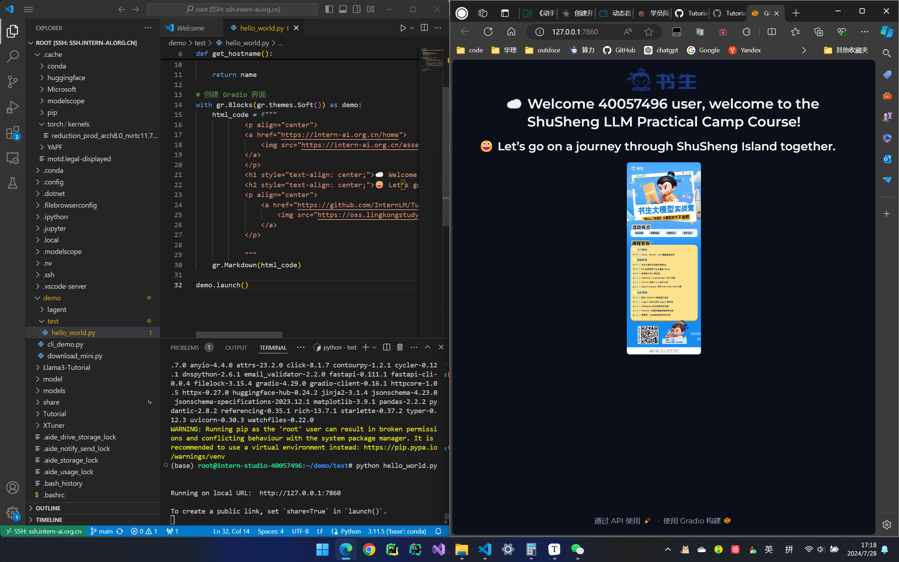
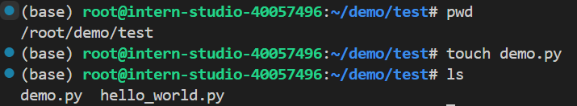
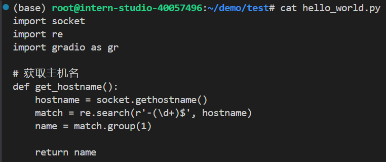
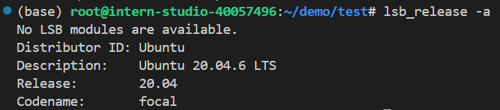

## 作业0: SSH连接&端口映射 

要理解端口映射所要解决的问题，首先要明确三个“电脑”：本地个人PC a，远程开发服务器 b，以及外网存储资源的服务器c

当我们在b上运行web_demo程序时，可能会遇到ui加载不全的问题，这就是因为b访问c出现了代理问题，为了解决这个问题，我们将b中的端口进行映射，映射到本地的主机a，通过a来访问c

```
ssh -p 40893 root@ssh.intern-ai.org.cn -CNg -L 7860:127.0.0.1:7860 -o StrictHostKeyChecking=no
```

上述命令的作用是：a通过b唯一暴露在外的40893端口进行ssh通信，告知b进行端口映射的隧道搭建，任何发送到a主机7860端口的流量，都会被ssh隧道转发到b主机127.0.0.1:7860端口处。

### example

```
pip install gradio==4.29.0
python hello_world.py // Running on local URL http://127.0.0.1:7860
```



成功实现了web服务的正常显示。

## 作业1：Linux基础命令

### touch/mkdir/cd/ls/pwd



### cat



## 作业2：使用 VSCODE 远程连接开发机并创建一个conda环境

### 学习TUMX

```
lsb_release -a // 查看ubuntu的系统信息
```



​	具体的使用方法可以查看：https://www.ruanyifeng.com/blog/2019/10/tmux.html

### conda换源

```
#设置清华镜像
conda config --add channels https://mirrors.tuna.tsinghua.edu.cn/anaconda/pkgs/main
conda config --add channels https://mirrors.tuna.tsinghua.edu.cn/anaconda/pkgs/free
conda config --add channels https://mirrors.tuna.tsinghua.edu.cn/anaconda/pkgs/r
conda config --add channels https://mirrors.tuna.tsinghua.edu.cn/anaconda/pkgs/pro
conda config --add channels https://mirrors.tuna.tsinghua.edu.cn/anaconda/pkgs/msys2
```

### 删除与导出虚拟环境

这一步非常重要，补充了我之前自学没学到的部分

```
# 删除某个虚拟环境
conda remove --name name --all
# 删除某个虚拟环境某个包
conda remove --name name package_name
```

```
# 获得环境中的所有配置
conda env export --name myenv > myenv.yml
# 重新还原环境

```

