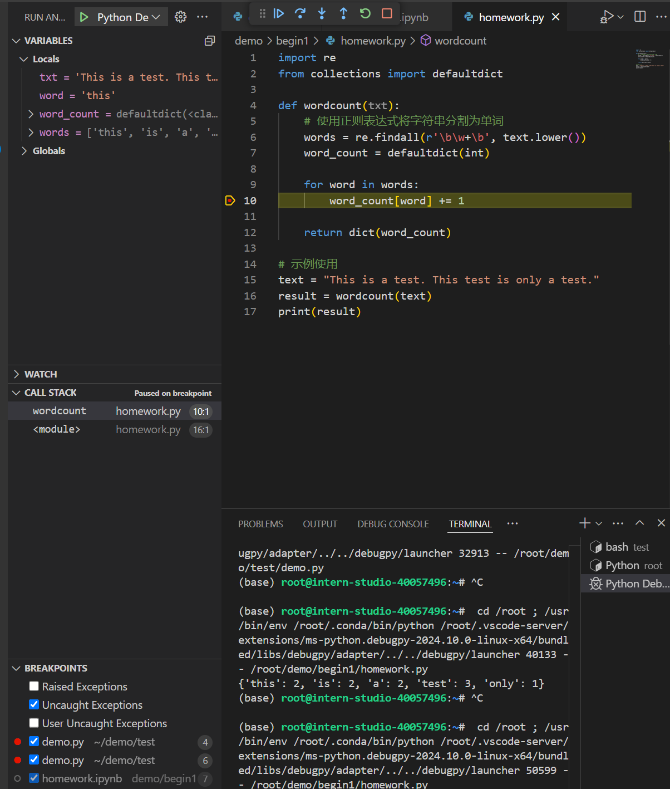

# L0-1：python基础

## 使用vscode进行Python debug流程

### 重点：在vscode中使用命令行进行debug 学习debug一整个项目

选择debugger时选择python debuger。选择debug config时选择remote attach就行，随后会让我们选择debug server的地址，因为我们是在本地debug，所以全都保持默认直接回车就可以了，也就是我们的server地址为localhost:5678。

```bash
python -m debugpy --listen 5678 --wait-for-client ./demo.py
```

### 遇到了问题：在使用命令行进行debug时仿佛无视了断点

### 遇到了问题：ipynb文件无法运行，一直报install python / jupyter extension

手动为远程ssh的主机安装 jupyter extension 

## 任务一：编写wordcount函数

```python
import re
from collections import defaultdict

def wordcount(txt):
    # 使用正则表达式将字符串分割为单词
    words = re.findall(r'\b\w+\b', text.lower())
    word_count = defaultdict(int)
    
    for word in words:
        word_count[word] += 1
    
    return dict(word_count)
```

## 任务二：debug wordcount函数

调试过程截图

